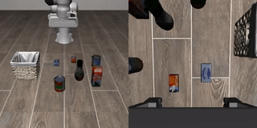

# vla.cpp - run SmolVLA

[vla.cpp](https://fai-modelopt-tech.github.io/vla-cpp.github.io/) is a portable C++
inference runtime for Vision-Language-Action (VLA) models, built on top of
[llama.cpp](https://github.com/ggml-org/llama.cpp). Each model ships as one self-contained
bundle and runs unchanged from a consumer GPU down to an 8 GB embedded module.

This app shows the optimization ideas from the examples applied to a real VLA model:
**SmolVLA**.

- Project page: https://fai-modelopt-tech.github.io/vla-cpp.github.io/
- Models: https://huggingface.co/collections/vrfai/vlacpp-model-bundles

## Build server and install sim env for client

Clone and build `vla.cpp` server with CUDA:
```bash
git clone https://github.com/VinRobotics/vla.cpp.git
cd vla.cpp
bash ./patches/patch.sh
cmake -B build \
    -DGGML_CUDA=ON \
    -DGGML_CUDA_GRAPHS=ON \
    -DCMAKE_BUILD_TYPE=Release \
    -DCMAKE_CUDA_ARCHITECTURES=$CUDA_ARCHITECTURE
cmake --build build
```

Creat simulation env with [uv](https://github.com/astral-sh/uv):
```bash
bash eval/sim/libero/setup_libero.sh
```

## Get the SmolVLA bundle

Download the model checkpoint
```bash
huggingface-cli download vrfai/smolvla-libero-gguf --local-dir models/smolvla
```

## Run

Start the server
```bash
./build/vla-server models/smolvla/mmproj-smolvla-libero.gguf models/smolvla/smolvla-libero.gguf
```

Run an LIBERO episode
```bash
source eval/sim/libero/libero_uv/.venv/bin/activate
python eval/client/run_sim_client_direct.py \
    --task libero_object --task-id 0 --n-episodes 1 \
    --output-dir /tmp/libero_outputs \
    --arch smolvla
```

Output video of the simulation can be found at `/tmp/libero_outputs`.

